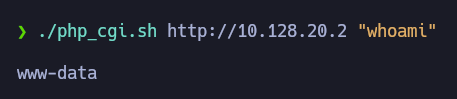

# PHP CGI Argument Injection (CVE-2012-1823)

[](https://www.php.net/manual)
[](https://www.cve.org/CVERecord?id=CVE-2012-1823)

## Description
> sapi/cgi/cgi_main.c in PHP before 5.3.12 and 5.4.x before 5.4.2, when configured as a CGI script (aka php-cgi), does not properly handle query strings that lack an = (equals sign) character, which allows remote attackers to execute arbitrary > code by placing command-line options in the query string, related to lack of skipping a certain php_getopt for the 'd' case.

## Usage
```
./php_cgi.sh http://<RHOST> <COMMAND>
```

## Example
```
./php_cgi.sh http://10.128.20.2 "whoami"
```

